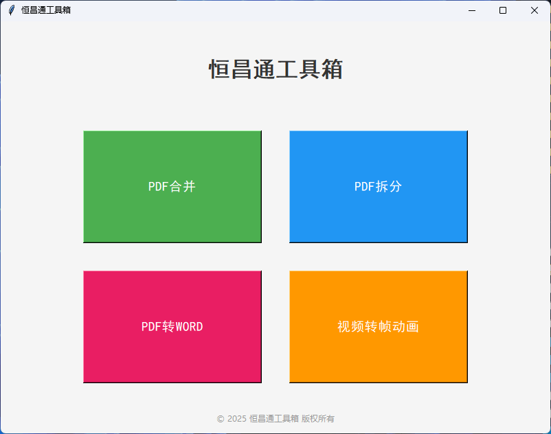

# 恒昌通工具箱

## 项目简介
恒昌通工具箱是一款功能强大的多用途文档处理软件，专为提高文档处理效率而设计。本工具箱集成了PDF文件处理、视频处理等多种实用功能，为用户提供一站式的文档管理解决方案。



## 功能特点

### PDF文件处理
- **PDF合并**：将多个PDF文件合并为单个文件，支持文件拖放、排序调整和预览
- **PDF拆分**：按页码范围或固定页数间隔拆分PDF文件，灵活满足各种分割需求
- **PDF转Word**：高质量将PDF文档转换为可编辑的Word格式，保留原始排版和格式

### 视频处理
- **视频转帧动画**：从视频中提取帧并转换为高质量图像序列
- **自定义分辨率**：支持自定义输出图片的分辨率，默认1024x600
- **智能帧率控制**：根据原视频帧率智能调整提取间隔（≤30fps每帧提取，>30fps每两帧提取一帧）
- **安卓开机动画生成**：一键生成符合Android系统规范的bootanimation引导动画文件

## 系统需求
- Windows 7/8/10/11
- Python 3.6或更高版本（如使用源码构建）
- 最小屏幕分辨率：800x600

## 安装说明

### 方式一：直接下载可执行文件
1. 从[发布页面](https://github.com/your-repo/hengchangtong-tools/releases)下载最新版本的可执行文件
2. 解压下载的压缩包
3. 运行`恒昌通工具箱.exe`即可使用，无需安装

### 方式二：从源码构建
1. 克隆或下载本项目源码
```
git clone https://github.com/your-repo/hengchangtong-tools.git
```

2. 安装所需依赖
```
pip install -r requirements.txt
```

3. 运行主程序
```
python simple_pdf_merger.py
```

4. （可选）构建可执行文件
```
python build.py
```

## 使用指南

### PDF合并
1. 在主界面选择"PDF合并"功能
2. 点击"添加文件"按钮选择要合并的PDF文件
3. 使用"上移"和"下移"按钮调整文件顺序
4. 点击"合并PDF"按钮，选择保存位置
5. 等待合并完成，系统将自动打开合并后的PDF文件

### PDF拆分
1. 在主界面选择"PDF拆分"功能
2. 点击"选择PDF文件"按钮选择要拆分的文件
3. 选择拆分方式：
   - 按页码范围拆分：输入如"1-3,5,7-9"格式的页码范围
   - 每N页拆分一个文件：输入每个文件包含的页数
4. 点击"开始拆分"按钮，选择保存目录
5. 系统将自动将PDF拆分为多个文件并保存到指定目录

### PDF转Word
1. 在主界面选择"PDF转Word"功能
2. 点击"选择PDF文件"按钮选择要转换的文件
3. 点击"转换为Word"按钮，选择保存位置和文件名
4. 等待转换完成，系统将提示转换成功

### 视频转帧动画
1. 在主界面选择"视频转帧动画"功能
2. 点击"选择视频文件"按钮选择要处理的视频
3. 点击"转换为帧图片"按钮，选择保存位置
4. 在参数设置界面：
   - 设置输出图片分辨率（默认1024x600）
   - 查看根据视频帧率自动计算的帧提取信息
   - 选择是否直接转换为帧动画文件（Android开机动画）
5. 点击"开始转换"按钮开始处理
6. 等待处理完成，系统将显示成功信息

## 开发者信息

### 项目结构
```
恒昌通工具箱/
├── simple_pdf_merger.py   # 主程序文件
├── build.py               # 构建脚本
├── requirements.txt       # 项目依赖
├── create_icon.py         # 图标生成工具
├── icons/                 # 图标资源目录
│   └── app_icon.ico       # 应用图标
└── README.md              # 项目说明文档
```

### 主要依赖
- PyPDF2：用于PDF文件处理
- pdf2docx：用于PDF到Word的转换
- OpenCV (cv2)：用于视频帧处理
- tkinter：用于构建图形用户界面

### 自定义应用图标
1. 准备一个清晰的图片（建议使用PNG或JPG格式，至少256x256像素）
2. 使用`create_icon.py`脚本将图片转换为ICO格式
```
python create_icon.py 您的图片路径.png icons/app_icon.ico
```
3. 重新构建应用
```
python build.py
```

## 故障排除

### 常见问题
1. **启动时报错**
   - 请确保已安装所有依赖
   - 检查Python版本是否兼容

2. **PDF合并/拆分失败**
   - 确认PDF文件未被其他程序占用
   - 检查文件是否受密码保护

3. **视频转换失败**
   - 确认已安装OpenCV库
   - 检查视频格式是否支持

4. **生成的可执行文件无法运行**
   - 尝试以管理员身份运行
   - 确认系统满足运行要求

### 日志收集
如遇到问题，请将程序控制台输出的错误信息发送给开发团队进行分析。

## 版权与许可
© 2025 恒昌通工具箱 版权所有

本软件为开源项目，依照MIT许可证发布。

## 联系方式
- 邮箱：support@hengchangtong.com
- 网站：https://www.hengchangtong.com
- 问题反馈：https://github.com/your-repo/hengchangtong-tools/issues # hengchangtong-tools
